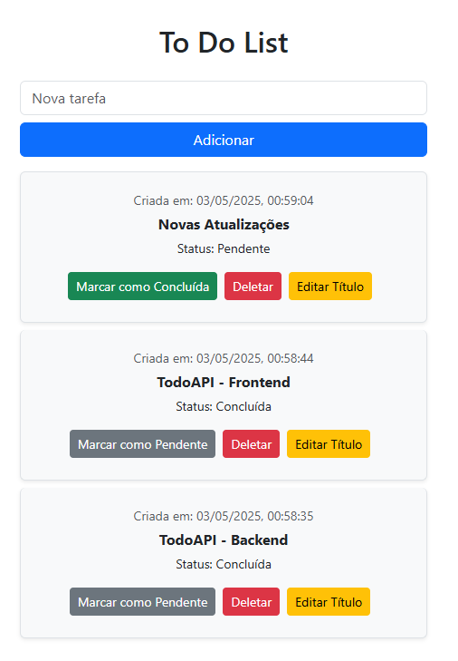

# ToDoApp - Frontend

Um aplicativo web moderno para gerenciamento de tarefas, desenvolvido com React e uma arquitetura de componentes bem estruturada.

Obs.: Backend em Java e Spring Boot encontra-se no repositório: [TodoApp-Backend](https://github.com/apolinario0x21/toDoApp)

## Sobre o Projeto
ToDoApp oferece:
- Interface intuitiva e responsiva
- Gestão completa do ciclo de vida de tarefas
- Feedback visual imediato
- Arquitetura escalável e bem organizada

## Tecnologias Utilizadas
- React 
- React Bootstrap
- Axios - Cliente HTTP para comunicação com APIs
- React Router - Para navegação entre páginas
- React Modal - Para modais de confirmação e edição
- Loading Spinner - Para animações de carregamento

## Componentes Principais

- TaskForm - Formulário para adicionar novas tarefas
- TaskList - Lista que renderiza as tarefas
- TaskItem - Componente que representa uma única tarefa
- EditTaskModal - Modal para edição de tarefas
- DeleteTaskModal - Modal de confirmação para exclusão

## 🚀 Instalação e Uso
### Pré-requisitos

- Node.js (v14 ou superior)
- npm ou yarn

### Configuração

1. Clone o repositório:

    git clone https://github.com/seu-usuario/task-manager.git
    cd task-manager

2. Instale as dependências:

    npm install ou yarn install

## 📂 Estrutura do Projeto
O projeto segue uma arquitetura modular e escalável, organizada nas seguintes camadas:
- node_modules/
- src/
    - components/
        - task/
            - TaskForm.jsx
            - TaskList.jsx
            - TaskItem.jsx
            - EditTaskModal.jsx
            - DeleteTaskModal.jsx
        - ui/
          - LoadingSpinner.jsx 
    - hooks/
        - useTasks.js
    - pages/
      - TaskPage.jsx
      - NotFoundPage.jsx
    - services/
      - taskService.jsx 
    - utils/
      - dateFormatter.jsx 
    - App.jsx
    - main.jsx

## ✅ Funcionalidades

- Visualização de tarefas com detalhes como data de criação e status
- Adição de novas tarefas
- Edição de títulos de tarefas existentes
- Marcação de tarefas como concluídas ou pendentes
- Exclusão de tarefas
- Validação de formulários

## 🔮 Roadmap (Futuras Implementações)

- Implementação de autenticação de usuários
- Filtros e ordenação de tarefas
- Categorização de tarefas
- Tema claro/escuro
- Toastify para feedbacks visuais
- Drag and drop para reordenar tarefas
- Vitest para testes unitários e de integração

## 🤝 Contribuição
Se você quiser contribuir com este projeto, siga estas etapas:

- Faça um fork do projeto
- Crie sua feature branch `git checkout -b feature/nova-funcionalidade`
- Commit suas mudanças `git commit -m 'Adiciona nova funcionalidade`
- Push para a branch `git push origin feature/nova-funcionalidade`
- Abra um Pull Request
